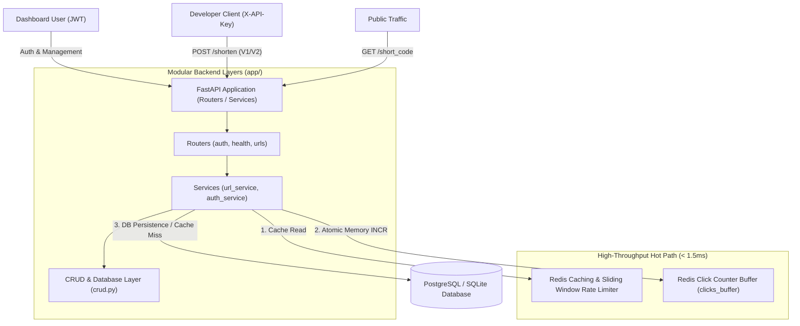

# 🚀 SaaS-Grade URL Shortener & Developer API Platform

A high-throughput, multi-tenant, production-grade **SaaS URL Shortener & Developer API Platform** built with **FastAPI**, **PostgreSQL / SQLite**, **Redis**, and **Alembic**.

Designed from first principles for high availability, sub-millisecond hot-path redirects, high-throughput Redis click analytics, and enterprise-grade security.

---

## 🏗️ System Architecture & Modular Design



---

## ✨ Key Features & Architectural Highlights

### 1. Enterprise Modular Architecture (`app/routers`, `app/services`, `app/schemas`)
* **Decoupled Architecture:** Clean separation of HTTP routing (`app/routers/`), pure business logic (`app/services/`), Pydantic models (`app/schemas.py`), and DB queries (`app/crud.py`).
* **Standardized JSON Error Payloads:** All HTTP exceptions and validation errors return unified `{"error": {"code": STATUS, "message": DETAIL}}` response shapes.

### 2. Dual-Tier Authentication & Security
* **Human Dashboard Auth:** OAuth2 Password Bearer with signed **HS256 JWT Access Tokens**.
* **Developer API Key Engine:** Programmatic keys (`sk_live_...`) with **SHA-256 Cryptographic Hashing**. Only SHA-256 hashes are persisted in the database.
* **OWASP Security Rules:** Password strength validation (min 8 chars, max 64 chars).
* **SSRF & Self-Loop Protection:** Prevents infinite redirection loops and blocks internal network IPs (`127.0.0.1`, `localhost`, `169.254.169.254`).

### 3. Custom Vanity Aliases & Link Expiration (HTTP 410 Gone)
* **Custom Vanity Aliases:** Supports custom alias codes (`custom_alias="my-brand"`) with regex format validation (`^[a-zA-Z0-9_-]{3,50}$`).
* **Reserved Route Protection:** Denylist (`RESERVED_ALIASES`) protects system paths (`dashboard`, `docs`, `health`, `v1`, `v2`, `auth`, `openapi.json`, `static`) from route hijacking.
* **Link Expiration Enforcement:** Supports `expires_at` UTC timestamps. Accessing expired links returns **HTTP 410 Gone**.

### 4. High-Performance Hot Path & Redis Atomic Click Buffer
* **Sub-Millisecond Redirects:** Redirect endpoints read directly from Redis cache with a 2-hour TTL.
* **Atomic Redis Memory Increment:** Increments click counters in Redis memory (`clicks_buffer:short_code`) in **0.1ms**, bypassing synchronous SQL disk locks under heavy viral traffic.

### 5. Two-Tier Sliding Window Rate Limiting
* **Tier 1 (Per-IP):** Protects public redirect routes using Redis Sorted Sets (`ZSET`) sliding windows (30 req/min).
* **Tier 2 (Per-API-Key Quota):** Dynamically enforces customized rate limit quotas assigned to developer API keys in the database.

### 6. Enterprise CRUD, Soft Deletes & Pagination
* **Paginated & Sorted Dashboard (`GET /urls`):** Filter by `owner_id`, `min_clicks`, `skip`, `limit`, and sort by `created_at` or `clicks`.
* **Role-Based Access Control (RBAC):** Strict ownership enforcement ensuring regular users can only manage their own URLs, with `admin` bypass privileges.
* **Audit-Safe Soft Deletes:** Setting `deleted_at` timestamps preserves analytics history while returning `HTTP 404 Not Found` for public redirects.

### 7. DevOps Probes, Redaction & Versioning
* **Liveness vs. Readiness Probes:** Separated `/health/live` (0ms process ping) from `/health/ready` (DB `SELECT 1` & Redis `PING` check returning 503 on dependency outage).
* **Zero-Trust PII Logging Middleware:** Starlette middleware redacting JWTs, API keys, cookies, and passwords before writing logs, while attaching high-precision `X-Process-Time-Ms` headers.
* **API Versioning (`/v1/` & `/v2/`) + RFC 8594 Sunset Policy:** Deprecates `/v1/` routes with `Sunset` and `X-API-Deprecated` headers while supporting `/v2/` breaking schema upgrades.
* **Google OAuth2 Identity Delegation:** Sign in with Google featuring CSRF `state` token validation, token exchange, and automatic account linking with existing email records.

---

## 🔌 API Endpoints Summary

| Method | Endpoint | Auth Required | Description |
| :--- | :--- | :--- | :--- |
| `GET` | `/health/live` | None | Liveness probe: process & event-loop status (200 OK) |
| `GET` | `/health/ready` | None | Readiness probe: DB & Redis dependency checks (503 if down) |
| `POST` | `/auth/signup` | None | Register a new user with OWASP password validation |
| `POST` | `/auth/login` | None | Authenticate and obtain JWT Access Token |
| `GET` | `/auth/me` | JWT | Fetch authenticated user profile & linked Google account |
| `GET` | `/auth/google/login` | None | Initiates Google OAuth2 flow with CSRF state token |
| `GET` | `/auth/google/callback`| None | OAuth2 callback, CSRF check, account linking & JWT issue |
| `POST` | `/auth/keys` | JWT | Generate a new Developer API Key (`sk_live_...`) |
| `GET` | `/auth/keys` | JWT | List developer API keys and assigned rate limits |
| `POST` | `/v1/shorten` | `X-API-Key` | V1 URL shortening with RFC 8594 `Sunset` deprecation header |
| `POST` | `/v2/shorten` | `X-API-Key` | V2 URL shortening with upgraded nested JSON response schema |
| `GET` | `/urls` | JWT | Paginated, filtered, and sorted URL dashboard list (RBAC) |
| `PATCH`| `/urls/{short_code}` | JWT | Update destination URL with strict ownership check |
| `DELETE`| `/urls/{short_code}`| JWT | Soft-delete URL resource |
| `GET` | `/{short_code}` | Per-IP Limit | Fast Redis Cache redirect + Atomic Click Counter Buffer |

---

## 🛠️ Quickstart & Local Setup

### Prerequisites
* **Python 3.10+** (Python 3.14 compatible)
* **Redis Server** (running on port `6379`)

### 1. Virtual Environment & Dependencies
```powershell
# Create and activate virtual environment
python -m venv venv
venv\Scripts\Activate

# Install required dependencies
uv pip install -r requirements.txt
```

### 2. Database Migrations (Alembic)
```powershell
alembic upgrade head
```

### 3. Run Application Server
Start the main FastAPI server:
```powershell
venv\Scripts\python -m uvicorn app.main:app --reload --port 8000
```

Interactive API documentation available at **`http://localhost:8000/docs`** and single-page dashboard at **`http://localhost:8000/dashboard/`**.

---

## 🧪 Running Automated Tests

Run the full integration test suite with `pytest`:

```powershell
venv\Scripts\python -m pytest -v
```

Output:
```text
============================= 10 passed in 6.73s =============================
```
