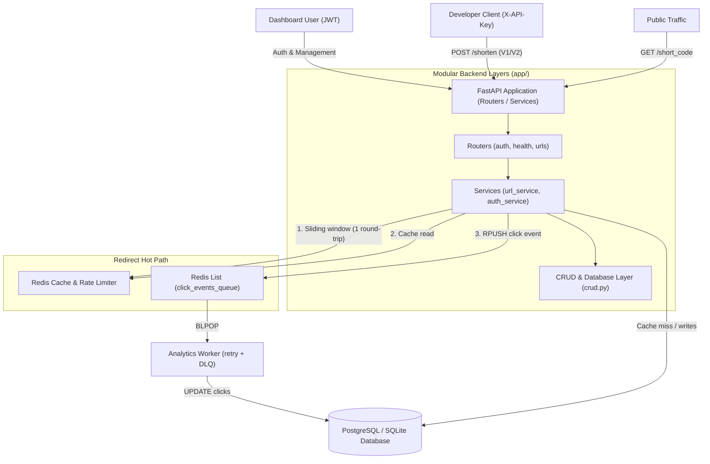

# 🚀 SaaS-Grade URL Shortener & Developer API Platform

A high-throughput, multi-tenant, production-grade **SaaS URL Shortener & Developer API Platform** built with **FastAPI**, **PostgreSQL / SQLite**, **Redis**, and **Alembic**.

Designed from first principles for high availability, a cache-backed redirect hot path, off-request-path click analytics, and enterprise-grade security. Performance claims below are [measured](#-measured-performance), not estimated.

---

## 🏗️ System Architecture & Modular Design



---

## ✨ Key Features & Architectural Highlights

### 1. Enterprise Modular Architecture (`app/routers`, `app/services`, `app/schemas`)
* **Decoupled Architecture:** Clean separation of HTTP routing (`app/routers/`), pure business logic (`app/services/`), Pydantic models (`app/schemas.py`), and DB queries (`app/crud.py`).
* **Standardized JSON Error Payloads:** All HTTP exceptions and validation errors return unified `{"error": {"code": STATUS, "message": DETAIL}}` response shapes.

### 2. Dual-Tier Authentication & Security
* **Human Dashboard Auth:** OAuth2 Password Bearer with signed **HS256 JWT Access Tokens**.
* **Developer API Key Engine:** Programmatic keys (`sk_live_...`) with **SHA-256 Cryptographic Hashing**. Only SHA-256 hashes are persisted in the database.
* **OWASP Security Rules:** Password strength validation (min 8 chars, max 64 chars).
* **Replay-Proof OAuth CSRF State:** State tokens live in Redis with a 15-minute TTL and are consumed with an atomic `DELETE`, so a state is valid exactly once and validation survives a restart or a second worker. Unknown states are rejected — validity is never inferred from the shape of the string.
* **SSRF & Self-Loop Protection:** Prevents infinite redirection loops and blocks internal network IPs (`127.0.0.1`, `localhost`, `169.254.169.254`).

### 3. Custom Vanity Aliases & Link Expiration (HTTP 410 Gone)
* **Custom Vanity Aliases:** Supports custom alias codes (`custom_alias="my-brand"`) with regex format validation (`^[a-zA-Z0-9_-]{3,50}$`).
* **Reserved Route Protection:** Denylist (`RESERVED_ALIASES`) protects system paths (`dashboard`, `docs`, `health`, `v1`, `v2`, `auth`, `openapi.json`, `static`) from route hijacking.
* **Link Expiration Enforcement:** Supports `expires_at` UTC timestamps. Accessing expired links returns **HTTP 410 Gone**.

### 4. Cache-Backed Hot Path & Off-Path Click Analytics
* **Cached Redirects:** The redirect reads the destination from Redis (TTL capped at 2 hours, or at the link's `expires_at` if sooner) and answers without touching SQL.
* **Graceful Degradation (verified with Redis stopped):** The cache read returns `None`, the rate limiter fails open, and the request falls through to the database. Redis is an accelerator here, not a single point of failure. Bounded client timeouts and disabled retries are what make this real — with library defaults the "fallback" never runs, because the client blocks instead of raising.
* **Clicks Leave the Request Path:** Each redirect `RPUSH`es a click event onto a Redis list; a separate worker `BLPOP`s it, writes to SQL, retries with exponential backoff, and parks poison events in a dead-letter queue. No SQL write happens while the user waits.

### 5. Two-Tier Sliding Window Rate Limiting
* **Tier 1 (Per-IP):** Protects public redirect routes using Redis Sorted Set (`ZSET`) sliding windows, defaulting to 30 req/min and tunable per environment via `IP_RATE_LIMIT`.
* **Tier 2 (Per-API-Key Quota):** Dynamically enforces customized rate limit quotas assigned to developer API keys in the database.
* **One Round-Trip Per Check:** Prune, record, count, and TTL-refresh ship as a single `MULTI` — measured as the largest single cost on the redirect path before batching.
* **Fails Open, Loudly:** If Redis is unreachable the limiter allows the request and logs a warning, rather than turning a cache outage into a redirect outage.

### 6. Enterprise CRUD, Soft Deletes & Pagination
* **Paginated & Sorted Dashboard (`GET /urls`):** Filter by `owner_id`, `min_clicks`, `skip`, `limit`, and sort by `created_at` or `clicks`.
* **Role-Based Access Control (RBAC):** Strict ownership enforcement ensuring regular users can only manage their own URLs, with `admin` bypass privileges.
* **Audit-Safe Soft Deletes:** Setting `deleted_at` timestamps preserves analytics history while returning `HTTP 404 Not Found` for public redirects.

### 7. DevOps Probes, Redaction & Versioning
* **Liveness vs. Readiness Probes:** Separated `/health/live` (0ms process ping) from `/health/ready` (DB `SELECT 1` & Redis `PING` check returning 503 on dependency outage).
* **Zero-Trust PII Logging Middleware:** Starlette middleware redacting JWTs, API keys, cookies, and passwords before writing logs, while attaching high-precision `X-Process-Time-Ms` headers.
* **API Versioning (`/v1/` & `/v2/`) + RFC 8594 Sunset Policy:** Deprecates `/v1/` routes with `Sunset` and `X-API-Deprecated` headers while supporting `/v2/` breaking schema upgrades.
* **Google OAuth2 Identity Delegation:** Sign in with Google featuring CSRF `state` token validation, token exchange, and automatic account linking with existing email records.

---

## 🔌 API Endpoints Summary

| Method | Endpoint | Auth Required | Description |
| :--- | :--- | :--- | :--- |
| `GET` | `/health/live` | None | Liveness probe: process & event-loop status (200 OK) |
| `GET` | `/health/ready` | None | Readiness probe: DB & Redis dependency checks (503 if down) |
| `POST` | `/auth/signup` | None | Register a new user with OWASP password validation |
| `POST` | `/auth/login` | None | Authenticate and obtain JWT Access Token |
| `GET` | `/auth/me` | JWT | Fetch authenticated user profile & linked Google account |
| `GET` | `/auth/google/login` | None | Initiates Google OAuth2 flow with CSRF state token |
| `GET` | `/auth/google/callback`| None | OAuth2 callback, CSRF check, account linking & JWT issue |
| `POST` | `/auth/keys` | JWT | Generate a new Developer API Key (`sk_live_...`) |
| `GET` | `/auth/keys` | JWT | List developer API keys and assigned rate limits |
| `POST` | `/v1/shorten` | `X-API-Key` | V1 URL shortening with RFC 8594 `Sunset` deprecation header |
| `POST` | `/v2/shorten` | `X-API-Key` | V2 URL shortening with upgraded nested JSON response schema |
| `GET` | `/urls` | JWT | Paginated, filtered, and sorted URL dashboard list (RBAC) |
| `PATCH`| `/urls/{short_code}` | JWT | Update destination URL with strict ownership check |
| `DELETE`| `/urls/{short_code}`| JWT | Soft-delete URL resource |
| `GET` | `/{short_code}` | Per-IP Limit | Fast Redis Cache redirect + Atomic Click Counter Buffer |

---

## 📊 Measured Performance

Numbers below come from `scripts/bench.py` (httpx only, no extra dependencies) on a
**Windows 11 / AMD64 / 8-core box, Python 3.14, single Uvicorn worker, SQLite + local
Redis**. This is a laptop, not a load-test rig — treat the ratios as the signal and the
absolute values as a ceiling imposed by one process on one machine.

| Scenario | Throughput | Server p50 | Server p99 |
| :--- | ---: | ---: | ---: |
| Redirect, cache hit, `c=1` | 94 req/s | **5.8 ms** | 11.1 ms |
| Redirect, cache hit, `c=50` | 222 req/s | 40.0 ms | 121.6 ms |
| Redirect, cache miss (DB fallback), serial | — | ~12 ms client-side | — |

`Server` is the application's own `X-Process-Time-Ms` header, so it excludes the
single-process load generator's queueing — client-observed latency at `c=50` is ~4x
higher and is a property of the benchmark client, not the server.

**What profiling changed.** The redirect originally issued **six sequential Redis
round-trips** (four for the sliding window, one cache read, one queue push). Batching
the rate-limiter's four commands into a single `MULTI` cut that to three:

| | Before | After |
| :--- | ---: | ---: |
| Server p50 @ `c=1` | 10.6 ms | **5.8 ms** |
| Throughput @ `c=50` | 127 req/s | **222 req/s** |

The remaining cost is dominated by per-request round-trips and the sync-endpoint
threadpool; the next wins would be async Redis and multiple workers.

**Behaviour with Redis stopped** (server started against a dead Redis port):

| Endpoint | Result |
| :--- | :--- |
| `GET /health/live` | `200` in 0.2s — liveness never touches dependencies |
| `GET /health/ready` | `503` in 0.7s — instance leaves the load-balancer rotation |
| `GET /{code}` | **`307` in 2.3s** — degraded, but still redirecting from SQL |
| `GET /{unknown}` | `404` — correct status, not a cache-induced error |

The 2.3s is four failed Redis attempts at a 0.25s timeout each. Serving slowly beats
not serving, and readiness pulls the instance out of rotation meanwhile — but the honest
next step is a circuit breaker that skips Redis entirely after N consecutive failures,
which would take this back to normal latency. That is not implemented.

Reproduce it:
```powershell
# raise the per-IP quota, or the benchmark measures 429s instead of redirects
$env:IP_RATE_LIMIT=1000000
venv\Scripts\python -m uvicorn app.main:app --port 8013
venv\Scripts\python scripts\bench.py --base-url http://localhost:8013
```

---

## 🛠️ Quickstart & Local Setup

### Prerequisites
* **Python 3.10+** (Python 3.14 compatible)
* **Redis Server** (running on port `6379`)

### 1. Virtual Environment & Dependencies
```powershell
# Create and activate virtual environment
python -m venv venv
venv\Scripts\Activate

# Install required dependencies
uv pip install -r requirements.txt
```

### 2. Database Migrations (Alembic)
```powershell
alembic upgrade head
```

### 3. Run Application Server
Start the main FastAPI server:
```powershell
venv\Scripts\python -m uvicorn app.main:app --reload --port 8000
```

Interactive API documentation available at **`http://localhost:8000/docs`** and single-page dashboard at **`http://localhost:8000/dashboard/`**.

---

## 🧪 Running Automated Tests

Run the full integration test suite with `pytest`:

```powershell
venv\Scripts\python -m pytest -v
```

Output:
```text
============================= 43 passed in 19.20s =============================
```

| Suite | Covers |
| :--- | :--- |
| `test_saas_platform.py` | Signup/login, API-key lifecycle, SSRF, ownership, OAuth, versioning, aliases |
| `test_security_boundaries.py` | Key hashing at rest, forged/expired credentials, log redaction, error envelope |
| `test_rate_limiting.py` | Per-IP and per-key sliding windows, quota isolation, window pruning |
| `test_redirect_hot_path.py` | Cache hit/miss, TTL clamped to expiry, soft-delete eviction, 404/410/307 |
| `test_dashboard_queries.py` | Pagination, sorting, filtering, owner scoping, admin bypass, retargeting |
| `test_analytics_worker.py` | Click persistence, bounded retries with backoff, dead-letter queue |

Redis and Postgres are stubbed in `tests/conftest.py`, so the suite runs with no
infrastructure. Note that stubbing the cache to always miss is what originally hid two
hot-path bugs (see the cache-lifecycle tests in `test_redirect_hot_path.py`).
