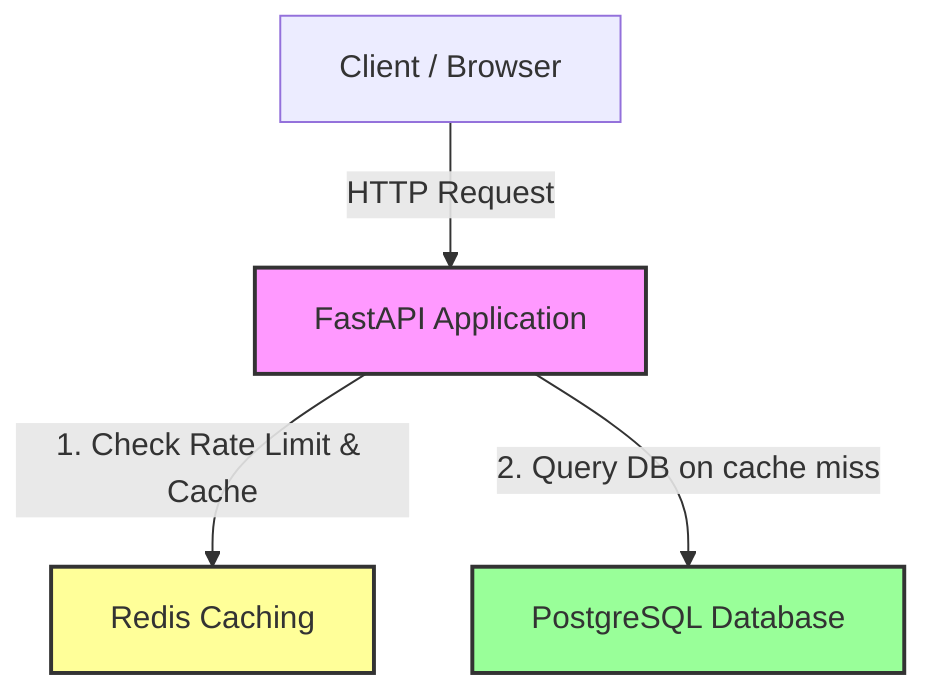

# Secure URL Shortener & Traffic Controller

A production-grade, highly performant, and containerized URL Shortener API built from first principles using **FastAPI**, **PostgreSQL**, and **Redis**.

## 🏗️ System Architecture

The following diagram illustrates how the services communicate within the Docker bridge network:



---

## ⚡ Key Features

1. **In-Memory & Persistent Dual Engines:** Dynamically switches database layers. Supports PostgreSQL for persistent production storage and fallback SQLite for lightweight local runs.
2. **Read-Through Caching Strategy:** Redirect lookups target memory cache (Redis) first. Caches shortened links with a configurable 2-hour TTL (Time-To-Live) on successful requests, bypassing disk databases and reducing latency to sub-2ms.
3. **Sliding Window Log Rate Limiter:** Protects endpoints from DDoS and spam using Redis Sorted Sets (`ZSET`). Tracks exact request timestamps per IP and blocks clients exceeding 5 requests/minute with a strict `HTTP 429 Too Many Requests` code.
4. **Clean Code Isolation:** Follows clean architecture, dividing the project into modular components (`main.py` routing, `database.py` connection pooling, `models.py` ORM mappings, `crud.py` repository queries, and `rate_limiter.py` middleware).
5. **Zero-Configuration Orchestration:** Containerized via Docker & Docker Compose, exposing custom non-conflicting host ports to fit seamlessly into microservice networks.

---

## 🚀 Getting Started

### Prerequisites
- Python 3.10+ (if running locally)
- Docker and Docker Compose (if running containerized)

### Method A: Running with Docker Compose (Recommended)
This spins up the FastAPI app, PostgreSQL, and Redis containers in an isolated network:

```bash
# Clone the repository and navigate inside
cd "URL Shortener"

# Start the multi-container stack
docker compose up --build -d
```

Access the interactive API documentation at **`http://localhost:8003/docs`**.

---

### Method B: Running Locally (Development Fallback)
1. **Initialize and Activate Virtual Environment:**
   ```bash
   python -m venv venv
   # On Windows:
   .\venv\Scripts\Activate
   # On Linux/macOS:
   source venv/bin/activate
   ```
2. **Install Dependencies:**
   ```bash
   pip install -r requirements.txt
   ```
3. **Run Application:**
   ```bash
   python -m uvicorn app.main:app --reload --port 8000
   ```

*Note: In local mode, database falls back to SQLite (`urls.db`). Ensure your local Redis server is running on port 6379.*

---

## 🧪 API Endpoints

- **`POST /shorten`**: Shortens a long URL.
  - **Payload:** `{"url": "https://example.com"}`
  - **Returns:** `{"short_code": "k8F2j9", "short_url": "http://localhost:8003/k8F2j9"}`
- **`GET /{short_code}`**: Redirects client to the original URL (HTTP 307) and increments the clicks counter.
