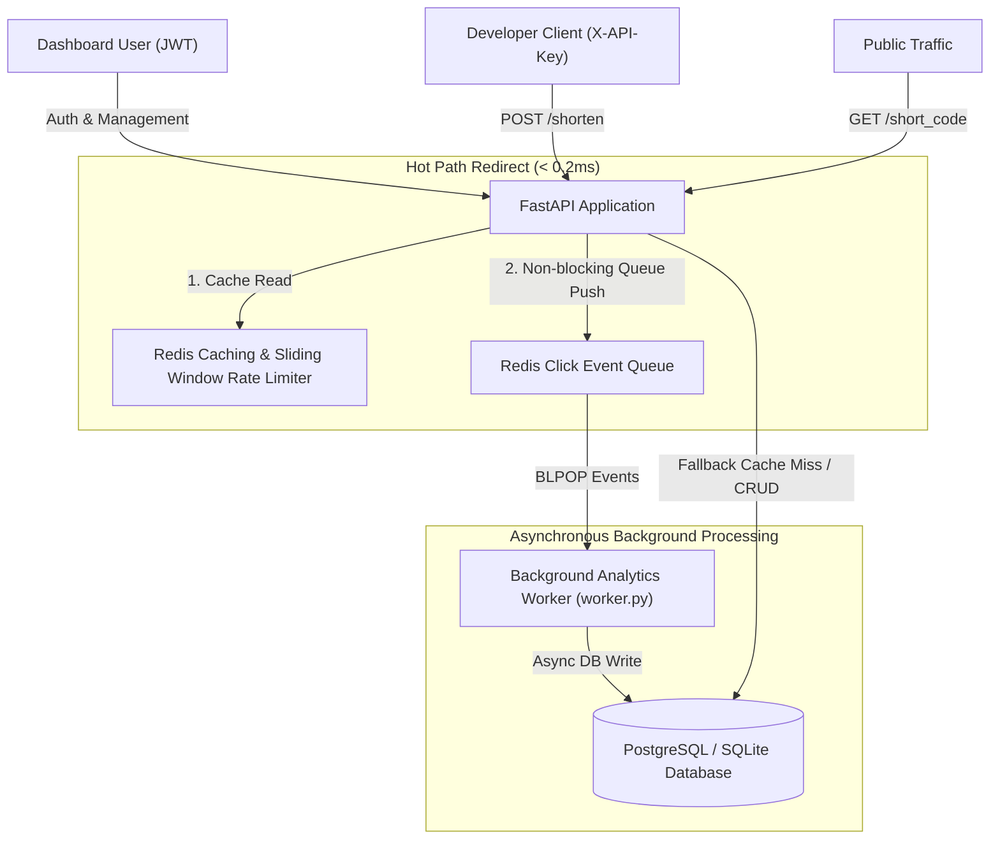

# 🚀 SaaS-Grade URL Shortener & Developer API Platform

A high-throughput, multi-tenant, production-grade **SaaS URL Shortener & Developer API Platform** built with **FastAPI**, **PostgreSQL / SQLite**, **Redis**, and **Alembic**.

Designed from first principles for high availability, sub-millisecond hot-path redirects, non-blocking click analytics, and enterprise-grade security.

---

## 🏗️ System Architecture



---

## ✨ Key Features & Architectural Highlights

### 1. Dual-Tier Authentication & Security
* **Human Dashboard Auth:** OAuth2 Password Bearer with signed **HS256 JWT Access Tokens**.
* **Developer API Key Engine:** Programmatic keys (`sk_live_...`) with **SHA-256 Cryptographic Hashing**. Only the SHA-256 hash is persisted in the database to prevent key leaks.
* **OWASP Security Rules:** Password strength validation (min 8 chars, uppercase, lowercase, numbers, special symbols).
* **SSRF & Self-Loop Protection:** Prevents infinite redirection loops and blocks internal network IPs (`127.0.0.1`, `localhost`, `169.254.169.254`).

### 2. High-Performance Hot Path & Async Click Analytics Queue
* **Sub-Millisecond Redirects:** Redirect endpoints read directly from Redis cache with a 2-hour TTL.
* **Non-Blocking Click Queue:** Redirect clicks are pushed to a Redis queue list (`click_events_queue`) in **< 0.2ms**, completely eliminating inline DB write latency.
* **Daemon Analytics Worker:** A standalone background process (`app/worker.py`) consumes click events via `BLPOP` and updates database counters asynchronously.

### 3. Two-Tier Sliding Window Rate Limiting
* **Tier 1 (Per-IP):** Protects public redirect routes using Redis Sorted Sets (`ZSET`) sliding windows (30 req/min).
* **Tier 2 (Per-API-Key Quota):** Dynamically enforces customized rate limit quotas assigned to developer API keys in the database.

### 4. Enterprise CRUD, Soft Deletes & Pagination
* **Paginated & Sorted Dashboard (`GET /urls`):** Filter by `owner_id`, `min_clicks`, `skip`, `limit`, and sort by `created_at` or `clicks`.
* **Role-Based Access Control (RBAC):** Strict ownership enforcement ensuring regular users can only manage their own URLs, with `admin` bypass privileges.
* **Audit-Safe Soft Deletes:** Setting `deleted_at` timestamps preserves analytics history while returning `HTTP 404 Not Found` for public redirects.

### 5. Cryptographically Secure Base62 Collision Protection
* Uses `secrets.choice` across Base62 characters (`a-z`, `A-Z`, `0-9`) with a **5-attempt bounded retry loop** for uniqueness guarantees.

---

## 🔌 API Endpoints Summary

| Method | Endpoint | Auth Required | Description |
| :--- | :--- | :--- | :--- |
| `POST` | `/auth/signup` | None | Register a new user with OWASP password validation |
| `POST` | `/auth/login` | None | Authenticate and obtain JWT Access Token |
| `POST` | `/auth/keys` | JWT | Generate a new Developer API Key (`sk_live_...`) |
| `GET` | `/auth/keys` | JWT | List developer API keys and their assigned rate limits |
| `GET` | `/health` | None | Verifies database and Redis connectivity |
| `POST` | `/shorten` | `X-API-Key` | Programmatic URL shortening with Per-Key Rate Limiting |
| `GET` | `/urls` | JWT | Paginated, filtered, and sorted URL dashboard list (RBAC) |
| `PATCH`| `/urls/{short_code}` | JWT | Update destination URL with strict ownership check |
| `DELETE`| `/urls/{short_code}`| JWT | Soft-delete URL resource |
| `GET` | `/{short_code}` | Per-IP Limit | Fast Redis Cache redirect + Async Click Analytics Queue |

---

## 🛠️ Quickstart & Local Setup

### Prerequisites
* **Python 3.10+** (Python 3.14 compatible)
* **Redis Server** (running on port `6379`)

### 1. Virtual Environment & Dependencies
```powershell
# Create and activate virtual environment
python -m venv venv
venv\Scripts\Activate

# Install required dependencies
uv pip install -r requirements.txt
```

### 2. Database Migrations (Alembic)
```powershell
alembic upgrade head
```

### 3. Run Application Server & Background Worker
Start the main FastAPI server in terminal 1:
```powershell
venv\Scripts\python -m uvicorn app.main:app --reload --port 8000
```

Start the Click Analytics Worker in terminal 2:
```powershell
venv\Scripts\python -m app.worker
```

Interactive API documentation available at **`http://localhost:8000/docs`**.

---

## 🧪 Running Automated Tests

Run the full integration test suite with `pytest`:

```powershell
venv\Scripts\python -m pytest
```

Output:
```text
============================== 6 passed ==============================
```

GitHub Actions runs this suite on every push and pull request. `POST /shorten` is intentionally the developer API surface: dashboard users use JWT to create API keys, then use those keys to shorten programmatically.
